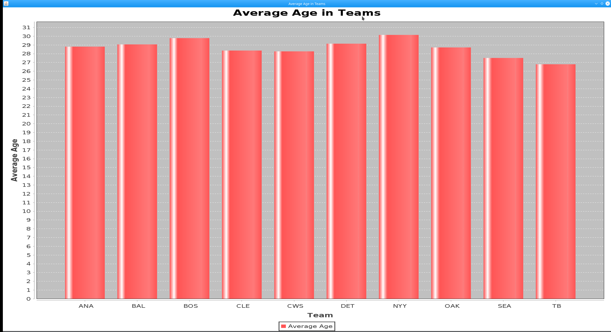

# Предисловие

Ниже подробно описан ход работы с фрагментами кода. В данном файле опущены такие вещи, как импорт библиотек или полноценный вид исходного файла. Все исходные файлы находится в папке **src**. Для более комфортного чтения кода  к фрагментам кода будет прилагаться короткое объяснение

# Ход работы
## Парсинг данных
По заданию необходимо разработать набор классов и распарсить CSV файл в набор объектов. Для начала скачаем файл CSV и ознакомимся с его содержимым 


<p align="center">
  
</p>


Оценив набор данных,  хранищихся в файле CSV, был разработан следующий класс

```java
public class Player {
    public String name;
    public String team;
    public String position;
    public int height;
    public int weight;
    public double age;

    public Player(String name, String team, String position, int height, int weight, double age) {
        this.name = name;
        this.team = team;
        this.position = position;
        this.height = height;
        this.weight = weight;
        this.age = age;
    }

    public String getName() {
        return name;
    }

    public String getTeam() {
        return team;
    }

    public String getPosition() {
        return position;
    }

    public Integer getHeight() {
        return height;
    }

    public Integer getWeight() {
        return weight;
    }

    public Double getAge() {
        return age;
    }
}
```

Сам парсер выглядит так

```java
public class parser {  
    public static List<Player> parseCSV(String csvFile) {  
        List<Player> players = new ArrayList<>();  
        String cvsSplitBy = ",";  
  
        try (BufferedReader br = new BufferedReader(new FileReader(csvFile))) {  
            br.readLine();  //Пропускаем заголовок  
  
            String line;  
            while ((line = br.readLine()) != null) {  
                Player player = createPlayerFromCSVLine(line, cvsSplitBy);  
                players.add(player);  
            }  
            System.out.println("Парсинг прошел успешно");  
        } catch (IOException e) {  
            System.out.println("При парсинге произошла ошибка");  
        }  
        return players;  
    }  
  
    private static Player createPlayerFromCSVLine(String line, String cvsSplitBy) {  
        String[] data = line.split(cvsSplitBy);  
        String name = data[0].trim().replace("\"", "");  
        String team = data[1].trim().replace("\"", "");  
        String position = data[2].trim().replace("\"", "");  
        int height = Integer.parseInt(data[3].trim());  
        int weight = Integer.parseInt(data[4].trim());  
        double age = Double.parseDouble(data[5].trim());  
  
        return new Player(name, team, position, height, weight, age);  
    }  
}
```

В ходе парсинга мы построчно считываем файл CSV в методе **parseCSV**. В этом методе мы удаляем заголовки файла и передаем набор данных одного игрока в метод **createPlayerFromCSVLine**, который возвращает нам объекты.

Таким образом, метод **parseCSV** возвращает нам список объектов, содержащих данные игроков из файла CSV

## Создание базы данных

Далее по заданию нам необходимо создать базу данных sqlite и перенести в нее данные, полученные из файла CSV. 

Для работы с sqlite в проект был добавлен драйвер **sqlite-jdbc-3.7.2.jar**

Удалим существующую базу данных. Это делается для предотвращения заполнения базы данных нежелательными данными при многоразовых запусках скрипта заполнения

```java
public static void deleteFile(String filePath) {  
    File file = new File(filePath);  
    if (file.exists()) {  
        if (file.delete()) {  
            System.out.println("Файл " + filePath + " успешно удален");  
        } else {  
            System.out.println("Не удалось удалить файл " + filePath);  
        }  
    } else {  
        System.out.println("Файл " + filePath + " не существует");  
    }  
}
```

Далее, подключимся к базе данных и создадим нужные таблицы. Связь таблиц выглядит следующим образом

<p align="center">
  
</p>

Сам скрипт подключения к базе данных и создания таблиц выглядит так

```java
public static void creatorDB(List<Player> players) {  
    //Подключение к базе данных, создание таблиц  
    Connection conn = null;  
    try {  
        Class.forName("org.sqlite.JDBC");  
        conn = DriverManager.getConnection("jdbc:sqlite:test.db");  
        System.out.println("База данных успешно подключена");  
  
        Statement statement = conn.createStatement();  
        statement.execute("CREATE TABLE IF NOT EXISTS players (id INTEGER PRIMARY KEY, name TEXT, weight INTEGER, height INTEGER, age REAL)");  
        statement.execute("CREATE TABLE IF NOT EXISTS player_info (player_id INTEGER PRIMARY KEY, team TEXT, position TEXT)");  
  
        for (Player player : players){  
            addPlayer(conn, player);  
        }  
        System.out.println("Таблицы успешно созданы");  
    } catch (Exception e) {  
        System.err.println(e.getClass().getName() + ": " + e.getMessage());  
    } finally {  
        try {  
            if (conn != null) {  
                conn.close();  
            }  
        } catch (SQLException e) {  
            System.err.println(e.getClass().getName() + ": " + e.getMessage());  
        }  
    }  
}
```

Скрипт для заполнения таблиц данными из CSV файла выглядит так

```java
private static void addPlayer(Connection conn, Player player) {  
    String insertPlayerSQL = "INSERT INTO players(name, weight, height, age) VALUES(?, ?, ?, ?)";  
    String insertPlayerInfoSQL = "INSERT INTO player_info(player_id, team, position) VALUES(?, ?, ?)";  
  
    try (PreparedStatement ps1 = conn.prepareStatement(insertPlayerSQL, Statement.RETURN_GENERATED_KEYS);  
         PreparedStatement ps2 = conn.prepareStatement(insertPlayerInfoSQL)) {  
        // Вставка данных в таблицу players  
        ps1.setString(1, player.getName());  
        ps1.setInt(2, player.getWeight());  
        ps1.setInt(3, player.getHeight());  
        ps1.setDouble(4, player.getAge());  
        int affectedRows = ps1.executeUpdate();  
        if (affectedRows == 0) {  
            throw new SQLException("Не удалось заполнить базу данных - нету данных для заполнения");  
        }  
        ResultSet generatedKeys = ps1.getGeneratedKeys();  
        if (generatedKeys.next()) {  
            int playerId = generatedKeys.getInt(1);  
            // Вставка данных в таблицу player_info  
            ps2.setInt(1, playerId);  
            ps2.setString(2, player.getTeam());  
            ps2.setString(3, player.getPosition());  
            ps2.executeUpdate();  
        } else {  
            throw new SQLException("Не удалось заполнить базу данных - нету ID");  
        }  
    } catch (SQLException e) {  
        System.out.println(e.getMessage());  
    }  
}
```

В ходе работы скрипта для базы данных, в методе **creatorDB** происходит подключение к базе данных и создание нужных таблиц. Далее, в цикле вызывается метод **addPlayer**, который принимает объекты **player**, считывает с них данные и заполняет ими таблицы. Результатом работы этого кода становится готовая база данных с таблицами, содержащими данные CSV файла

## Выполнение запросов
Итак, пришло время выполнить набор запросов к базе данных. Сами запросы звучат так

Первый запрос
- Постройте график по среднему возрасту во всех командах.

Второй запрос
- Найдите команду с самым высоким средним ростом. Выведите в консоль 5 самых высоких игроков команды.

Третий запрос

- Найдите команду, с средним ростом равным от 74 до 78 inches и средним весом от 190 до 210 lbs, с самым высоким средним возрастом.


### Первый запрос

Для реализации данного запроса использовалась библиотека jfreechart, для работы с  которой были подгруженны в проект **jcommon-1.0.23.jar** и **jfreechart-1.0.19.jar**

Сам код выглядит так

```java
public static void first_query() {  
    String url = "jdbc:sqlite:test.db";  
  
    try (Connection conn = DriverManager.getConnection(url);  
         Statement statement = conn.createStatement()) {  
  
        // Запрос для нахождения среднего возраста во всех командах  
        String query = "SELECT team, AVG(age) AS avg_age FROM players " +  
                "JOIN player_info ON players.id = player_info.player_id " +  
                "GROUP BY team";  
  
        ResultSet resultSet = statement.executeQuery(query);  
  
        DefaultCategoryDataset dataset = new DefaultCategoryDataset();  
  
        while (resultSet.next()) {  
            String team = resultSet.getString("team");  
            double avgAge = resultSet.getDouble("avg_age");  
            dataset.addValue(avgAge, "Average Age", team);  
        }  
  
        JFreeChart barChart = ChartFactory.createBarChart(  
                "Average Age in Teams",  
                "Team",  
                "Average Age",  
                dataset);  
  
        // Отображение графика в окне  
        JFrame frame = new JFrame("Average Age in Teams");  
        frame.setDefaultCloseOperation(JFrame.EXIT_ON_CLOSE);  
        ChartPanel chartPanel = new ChartPanel(barChart);  
        frame.add(chartPanel);  
        frame.pack();  
        frame.setVisible(true);  
  
    } catch (SQLException e) {  
        System.out.println("Ошибка при работе с базой данных: " + e.getMessage());  
    }  
}
```

Результат

<p align="center">
  
</p>

## Второй запрос

Реализация запроса имеет следующий вид

```java
public static void second_query() {  
    String url = "jdbc:sqlite:test.db";  
  
    try (Connection conn = DriverManager.getConnection(url);  
         Statement statement = conn.createStatement()) {  
  
        // Запрос для нахождения команды с самым высоким средним ростом  
        String query = "SELECT team, AVG(height) AS avg_height FROM players " +  
                "JOIN player_info ON players.id = player_info.player_id " +  
                "GROUP BY team ORDER BY avg_height DESC LIMIT 1";  
  
        ResultSet resultSet = statement.executeQuery(query);  
  
        if (resultSet.next()) {  
            String teamWithHighestAverageHeight = resultSet.getString("team");  
            System.out.println("Команда с самым высоким средним ростом: " + teamWithHighestAverageHeight);  
  
            // Запрос для нахождения 5 самых высоких игроков команды  
            query = "SELECT name, height FROM players " +  
                    "JOIN player_info ON players.id = player_info.player_id " +  
                    "WHERE team = ? ORDER BY height DESC LIMIT 5";  
  
            PreparedStatement preparedStatement = conn.prepareStatement(query);  
            preparedStatement.setString(1, teamWithHighestAverageHeight);  
            resultSet = preparedStatement.executeQuery();  
  
            System.out.println("Самые высокие игроки команды:");  
            while (resultSet.next()) {  
                String playerName = resultSet.getString("name");  
                int playerHeight = resultSet.getInt("height");  
                System.out.println(playerName + " - " + playerHeight + " см");  
            }  
        } else {  
            System.out.println("База данных пустая, либо данных о командах нет");  
        }  
  
    } catch (SQLException e) {  
        System.out.println("Не удалось подключиться к базе данных" + e.getMessage());  
    }  
}
```

и результат выполнения  скрипта

```
Команда с самым высоким средним ростом:  CWS
Самые высокие игроки команды:
Andrew Sisco - 81 см
Jon Garland - 78 см
Matt Thornton - 78 см
Jermaine Dye - 77 см
David Aardsma - 77 см
```

## Третий запрос

И наконец, третий запрос был реализован вот так

```java
public static void third_query() {  
    String url = "jdbc:sqlite:test.db";  
  
    try (Connection conn = DriverManager.getConnection(url);  
         Statement statement = conn.createStatement()) {  
  
        // Запрос для нахождения команды с условиями по росту и весу  
        String query = "SELECT team, AVG(height) AS avg_height, AVG(weight) AS avg_weight, AVG(age) AS avg_age FROM players " +  
                "JOIN player_info ON players.id = player_info.player_id " +  
                "GROUP BY team " +  
                "HAVING avg_height BETWEEN 74 AND 78 AND avg_weight BETWEEN 190 AND 210 " +  
                "ORDER BY avg_age DESC LIMIT 1";  
  
        ResultSet resultSet = statement.executeQuery(query);  
  
        if (resultSet.next()) {  
            String teamWithConditionsMet = resultSet.getString("team");  
            double avgHeight = resultSet.getDouble("avg_height");  
            double avgWeight = resultSet.getDouble("avg_weight");  
            double avgAge = resultSet.getDouble("avg_age");  
  
            System.out.println("Команда, удовлетворяющая условиям:");  
            System.out.println("Название: " + teamWithConditionsMet);  
            System.out.println("Средний рост: " + avgHeight + " inches");  
            System.out.println("Средний вес: " + avgWeight + " lbs");  
            System.out.println("Средний возраст: " + avgAge + " лет");  
        } else {  
            System.out.println("Нет команд, удовлетворяющих условиям");  
        }  
  
    } catch (SQLException e) {  
        System.out.println("Ошибка при работе с базой данных: " + e.getMessage());  
    }  
}
```

Результат выполнения скрипта

```
Команда, удовлетворяющая условиям:
Название:  NYY
Средний рост: 74.34375 inches
Средний вес: 208.3125 lbs
Средний возраст: 30.1496875 лет
```
